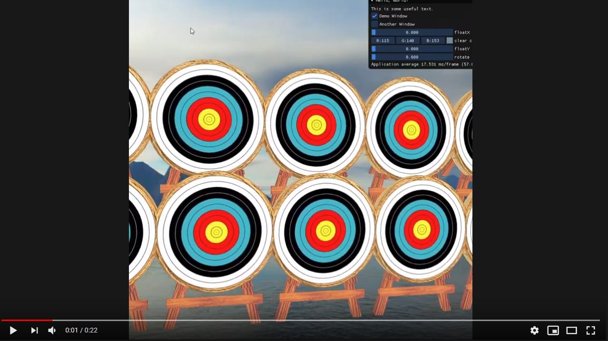

# Demo Game Video

# Revisiting the Initial Goals

## Practice good C++

Starlight's large feature scope and rigorous requirements was an excellent playground for practicing C++ and Windows development quirks. However, our goal of incorporating all the skills we learned from Scott Myers' C++ books was often at odds with researching engine implementation details and doing the actual software engineering task. The result was an engine that inconsistently used a small subset of modern C++ features like smart pointers, constexpr, and template metaprogramming, which was good practice in itself but by no means a thorough showcase of modern C++ features.

## Improve software development habits

The intimate two-person development team environment led to almost every subsystem we built being revisited and revised as the other person began to use the subsystem and found faults. Examples of this ranged from Math getting Matrix4 and Vector4 support and simplifying `MemMgr::Free`'s call signature to require less manual bookkeeping by the gameplay programmer. Additionally, diving into each other's subsystems was an excellent exercise in quickly understanding someone else's code and writing readable code that fits with the style of the file. This was exactly the dynamic that we wanted to train throughout this project. 

## Make a functioning game engine capable of supporting first-person experiences

Starlight is a minimal game engine that supports first-person experiences with some obvious room for improvement (listed in "Starlight's Next Steps" below).

We would have loved to have hosted a brief 6 or 12 hour game jam with competent C++ developers familiar with the ECS paradigm and survey their opinions on Starlight's learning curve and ease of use. This would have created our first action points to improve the engine - we can make guesses, but we will never be as removed from the process as a fresh gameplay programmer.

## Provide substantial learning resources for aspiring engine developers

That's what this documentation is!

# Starlight's Next Steps

## System message passing

When developing the demo game, we discovered Starlight's most urgent need to make games is to have ECS systems communicate with each other via dedicated message passing. This would be similar to an event dispatch system where interested listeners are notified when an event they are subscribed to fires off. Our ring buffer data structure would be an excellent candidate to implement this feature. 

As it stands, systems that need to communicate with each other will set explicit boolean flags in components that both systems care about. One system setting a flag to true will indicate to the other system that a specific event can be fired off like a sound effect. This quickly gets messy as components quickly have a lot of logic that should be between systems and as such does not scale well at all.

## Camera Abstraction in ECS

Because of the process we had of converting the entire rendering system to an ECS-friendly architecture, we left the first-person camera as an unconverted outlier since it was not critical to game function. Since many gameplay functions needed to know of the camera's location data to function properly (like its location and forward vector), we elevated cameras to a global visibility for any system to access. Moving forward, the camera needs to be more thoughtfully refitted as a `CameraComponent` that can be slotted into a Camera entity with stricter access patterns.

## Fully Data-Driven Scene Description

Starlight's most gaping weakness is how much of the initial setup is done in the program's entry point. Every entity that is part of the initial scene configuration at startup must be defined in code. To overcome this, Starlight needs to be able to read in a scene description file of entities, their components, and initialization for each of those components to be loaded in at runtime.

## User-Friendly Scene Editor

After entity configuration is abstracted to a data format like a scene description file, work can be made to build out our simple ImGui implementation to allow gameplay programmers to visually set up their scene by transforming objects in real-time before running their game. This would be way more usable than the current system of editing code values, compiling, and running to see placement changes.

# Final Timeline
|           | March 19 | April 19 | May 19 | June 19 | July 19 | Aug 19 | Sept 19 | Oct 19 | Nov 19 | Dec 19 | Jan 20 | Feb 20 | March 20 |
|-----------|----------|----------|--------|---------|---------|--------|---------|--------|--------|--------|--------|--------|----------|
| Jake      | Math     | Math |Math, File I/O|File I/O|File I/O|Resource Manager|Resource Manager|ECS     |ECS     |ECS     | Input, Audio | Audio, Rendering |ECS, Demo Game|
| Alejandro | Memory Manager | Memory Manager | Memory Manager | Rendering Research | Rendering, UI | Rendering | Rendering | Rendering | Collision Research | Collision Detection | Port Rendering to ECS | Port Rendering to ECS | Port Collisions to ECS|

## Notes

* While we initially planned to use summer for our internships, each of us ended up dedicating 3-4 hours after work daily to catch up on Starlight
* Due to unpredictable difficulties like hard to use libraries and larger-than-expected features, we dropped support for animations, networking, and full multithreading
* We remained fluid when one team member was blocked on a hard problem - often taking over entire subsystems or helping fix bugs in each other's code